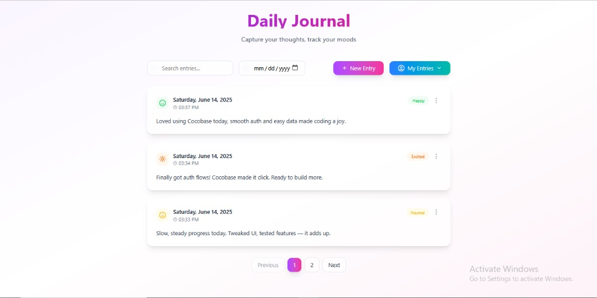
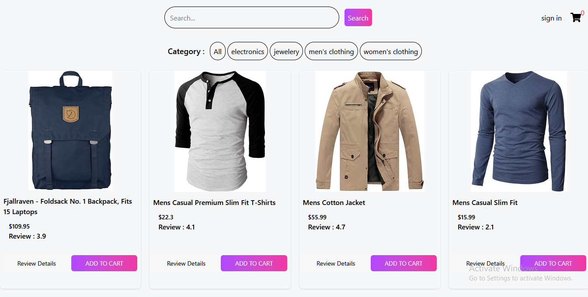

--- 
title: Example Projects
# slug: /sample
sidebar-position: 5
---

# Daily Journal

[Live Demo](https://cocobase-project.vercel.app/) | [GitHub Repository](https://github.com/cyberdiego33/cocobase-project)

A modern daily journal web app that lets users browse public journals by mood and securely create their own private entries. Built with Cocobase as the backend, it features user authentication, real-time updates, and a clean, intuitive interface.

---

# E-commerce Sample

[Live Demo](https://cocobase-sample-project.vercel.app/) | [GitHub Repository](https://github.com/Challmejosh/cocobase-sample-project)

A sample e-commerce web application demonstrating product listings, shopping cart functionality, and secure user authentication. Powered by Cocobase, it showcases real-time updates and a modern, responsive design.